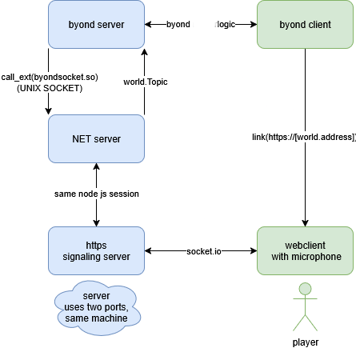

# voice chat byond

## general architecture

* [getUserMedia()](https://developer.mozilla.org/en-US/docs/Web/API/MediaDevices/getUserMedia) requires secure context to run (not http), so for now, Im using bogus certificates to serve over **https**. However it might be possible to serve the site over **byond** with something like `browse_cache("voicechat.html")` and use `link("file:///byond_web_cache_dir/voicechat.html")` instead
* right now distance is calculated at **O(N^2)**, however using a spatial indexing library like [rbush](https://github.com/mourner/rbush), it might be possible to get it down to **O(N * log(N) + idk)**
* roughly **10% of rtc connections fail** with this setup. This might be preventable by running a local [TURN](https://webrtc.org/getting-started/turn-server) server.



## building

I dont understand most ss13 build systems so you will have to run a few commands manually.

* or all at once: **run from project root**

    ```bash
    sudo apt install g++-multilib npm -y && cd voicechat/pipes && make && cd ../node && npm install && cd ../..
    ```

1. ensure you have **g++-multilib** and **npm** installed
    * `sudo apt install g++-multilib npm`
2. build **byondsocket.so** library
    * to talk to node from byond I use [unix sockets](https://en.wikipedia.org/wiki/Unix_domain_socket) and so we make a simple library to send stuff through an existing socket from byond.
    * `cd voicechat/pipes && make`
    * the only thing stopping me from making this crossplatform, is that I couldnt figure out how to make socket DLL for windows.
3. install **node dependencies**
    * while this **could be done through TGS** I dont understand it, so I use something more retard proof like **node** to handle signaling and hosting static webpage
    * `cd ../node && npm install`
4. verify it worked
    * to **test node**, run `node voicechat/node/server/main.js`
    * if it worked it should run but with message about missing arguements

        ```txt
        HTTPS server running on port undefined
        socket server listening on byond_node.sock
        Failed to send command: The "options" or "port" or "path" argument must be specified
        ```

    * to **verify the library** you can do `ldd byondsocket.so`
    and it should return something along the lines of (with **different numbers**):

        ```txt
        linux-gate.so.1 (0x111111)
        libgcc_s.so.1 => /lib/i386-linux-gnu/libgcc_s.so.1 (0123546)
        libc.so.6 => /lib/i386-linux-gnu/libc.so.6 (0x1234567)
        /lib/ld-linux.so.2 (0x42069)
        ```
